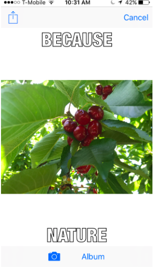
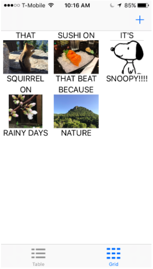

# Meme Me 
An app that allows you to:
- capture and crop pictures which you _meme-ify_ by adding white text on the top and bottom
- apply custom fonts and font- sizes to your memes
- share your memes
- view previously created memes in a `UITableView` or `UICollectionView`.

## Some of the knowledge gained
- using `UITableView` and `UICollectionView` as well as customizing them
- accessing system fonts and programmatically customize fonts
- taking screenshots with core graphics
- and more!

